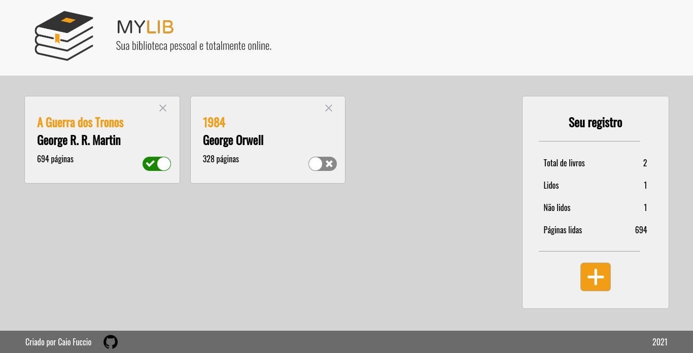
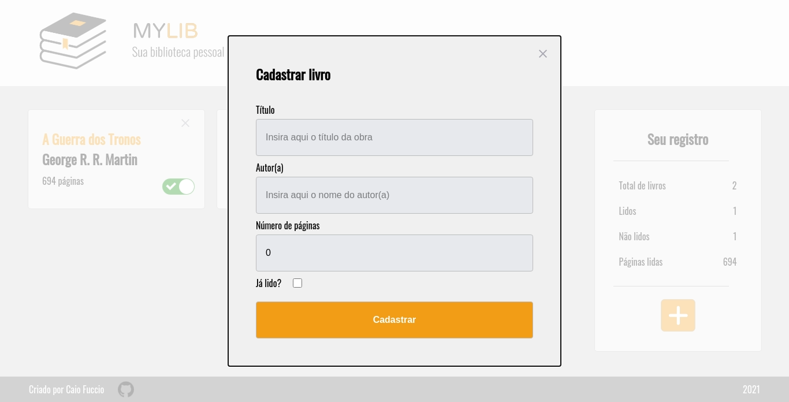

	
	
  
  
  <a href="https://github.com/caiofuccio">
	  
	<a/>
  

 

<h1  align="center">
  
</h1>

 <a href="#-sobre">Sobre</a> •
 <a href="#-funcionalidades">Funcionalidades</a> •
 <a href="#-layout">Layout</a> • 
 <a href="#-como-executar">Como executar</a> • 
 <a href="#-tecnologias">Tecnologias</a> • 
 <a href="#-autor">Autor</a> •
 <a href="#-licença">Licença</a>

<h4 align="center"> 
	🚧  Em construção...  🚧
</h4>
 

## 💻 Sobre

O MyLib é um aplicativo para criação da sua biblioteca pessoal e totalmente online, onde você pode cadastrar os livros que está lendo e suas leituras futuras. Ele ainda oferece um registro com o seu total de livros cadastrados, apresentando quantos desses foram lidos e quantos faltam ler e o número total de páginas lidas.

Esse projeto foi criado utilizando ReactJS.

---

## ⚙️ Funcionalidades

- [x] Adição de livros através de um formulário em um modal.
- [x] Remoção dos livros cadastrados a partir de um botão no card.
- [x] Renderização dinâmica dos dados apresentados no registro.
- [ ] Criação de um design responsivo para diferentes telas.
- [ ] Persistência dos dados inseridos em localStorage ou Cloud.

---

## 🖼️ Layout

 

---

## 🧰 Como executar

    # Clone o repositório
    $ git clone git@github.com:caiofuccio/my-lib.git

    # Instale as dependências
    $ yarn

    # Execute a aplicação no modo de desenvolvimento
    $ yarn start

    # A aplicação será aberta na porta:3000 - acesse https://localhost:3000

---

## 🚀 Tecnologias

	
	
	 
	
	
  
	 
  
   
	
---

## 👨‍💻 Autor

	
	 
	<strong>Caio Fuccio</strong>
	 
	 Front-End Developer | ReactJS
	 
	 
	
	

---

## ⚖️ Licença

Este projeto está sob a licença MIT.

Acesse o arquivo de [LICENSE](./LICENSE) para mais informações.
